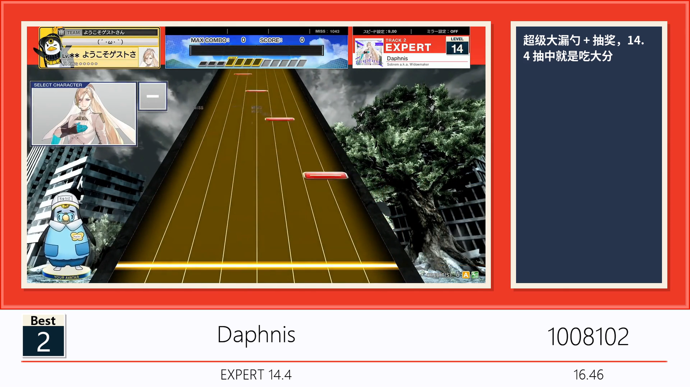

# chu-gen-videob30

自动从流媒体上搜索并构建你的中二节奏 best30 视频

Auto search and generate your best 30 videoes of CHUNITHM

## 快速开始
<!-- 
- 如果你具有基本的计算机和python知识，可以独立（或者GPT辅助）完成环境配置和脚本操作，请直接clone仓库代码，参考[使用说明](#使用说明（从源代码启动）)部分开始使用! -->

<!-- - 如果你没有上述经验，请**从右侧Release页面下载最新的**打包版本，参考[【教程视频】](https://www.bilibili.com/video/BV1G2kBY5Edq)开始使用。 -->
- **从右侧 Release 页下载最新** Release 包。
    - （目前）**仅支持 Windows10 及以上操作系统**
    - 请 **完整解压** 后双击 `start.bat` 启动应用（Release 包 **不用管下面的使用说明**）
    - 如要求您输入 Email，回车跳过，遇到问题参考[常见问题](#常见问题)
- 不要问为什么我会把有人不喜欢的平台链接放进来，~~因为真有不懂怎么弄的人~~

## 效果预览

- 生成视频帧效果

<figure>
  
  <figcaption style="text-align: center; font-size: large;">默认情况</figcaption>
</figure>

<figure>
  
  <figcaption style="text-align: center; font-size: large;">添加 verse 定数</figcaption>
</figure>


## 特性

本工具的原理是：

- 从查分器获取你的 Best30 数据并保存在本地。

- 从流媒体上搜索并下载谱面确认视频并保存在本地。

- （你所要做的）编辑视频里要展示的内容，包括片段长度、评论等。

- 自动根据已缓存的素材合成视频。

数据源支持情况：

- [x] [水鱼查分器](https://www.diving-fish.com/maimaidx/prober/)：请注意在个人选项中关闭掩码，并允许公开获取你的 B30 数据

- [x] [落雪查分器](https://maimai.lxns.net/)：您需要提供个人 API 密钥用于获取 B30 数据

- [ ] [CHUNITHM-NET（国际服）](https://lng-tgk-aime-gw.am-all.net)：因缺少测试样本，我们目前无法支持此数据源

<!-- 由于 verse 修改 Rating 机制为 b30 + [b20](https://wikiwiki.jp/chunithmwiki/%E3%83%AC%E3%83%BC%E3%83%86%E3%82%A3%E3%83%B3%E3%82%B0%E3%83%BBOVER%20POWER#h3db37e3)，加上 -->

流媒体源支持情况：

- [x] [youtube](https://www.youtube.com/)

- [x] [bilibili](https://www.bilibili.com/)

计划特性（bug）开发情况：

<!-- - [x] 可交互的全流程界面（streamlit）

- [x] 支持一键更换页面主题配色

- [x] 更好的b30数据存档系统，可以保存多个历史副本
 -->

- [ ] 重构搜索逻辑，使其可通过 ID 或关键字搜索

---

## 使用说明（从源代码启动）

1. 安装python环境和依赖，推荐使用 `conda`。注意 python 版本 ≥ 3.10

    ```bash
    conda create -n chu-gen-videob30 python=3.10
    conda activate chu-gen-videob30
    ```

2. 从 requirements.txt 安装依赖

    ```bash
    pip install -r requirements.txt
    ```
    <!-- > 登录 b 站需要弹出 tkinter 窗口。而 linux 的 python 没有预装`tk`库，
    请自行`sudo apt-get install python3-tk`安装。 -->

3. 安装ffmpeg（若从 Release 下载可忽略）：

    - Windows：下载 [ffmpeg-release-essentials.zip](https://www.gyan.dev/ffmpeg/builds/ffmpeg-release-essentials.zip)，解压后将 `bin` 目录所在路径[添加到系统环境变量](https://blog.csdn.net/2401_82486820/article/details/143490683)。

    - Linux：`sudo apt-get install ffmpeg`

    
1. 使用下面的命令启动 streamlit 网页应用

    ```
    streamlit run st_app.py
    ```
    在网页运行程序时，请保持终端窗口打开，其中可能会输出有用的调试信息。
    
#### 其他注意事项

- 使用youtube源且使用代理下载可能会遇到风控情况，此时请额外按照youtube的 po token生成相关依赖，具体请参考：[使用自定义OAuth或PO Token](docs/UseTokenGuide.md)

- 由于目前缺少国际服 CHUNITHM-NET 的样本，无法支持从本地导入 JSON 游玩数据生成分表。

---

## 常见问题

### 安装环境相关

- `ModuleNotFoundError: No module named 'moviepy'`

    请检查是否配置好python环境且 ≥ 3.10，并安装 `requirements.txt` 的所有依赖。

- `NameError: name 'sys' is not defined`
    你可能手动清理了项目里的 `__pycache__` 文件夹（Release 不会打包此文件夹）
    - 需要时间进行编译，大概保留控制台 2 ~ 3 分钟左右重启程序即可
    - 默认端口 8501，如果当前端口不是这个值，请检查是否还有未关闭的程序

- 出现类似如下的报错：

    ```
    OSError: [WinError 2] The system cannot find the file specified

    MoviePy error: the file 'ffmpeg.exe' was not found! Please install ffmpeg on your system, and make sure to set the path to the binary in the PATH environment variable
    ```

    检查python环境和`ffmpeg`是否安装正确，确保其路径已[添加到系统环境变量](https://blog.csdn.net/2401_82486820/article/details/143490683)


### 视频抓取相关

- 网络链接问题

    ```
    [WinError 10060] 由于连接方在一段时间后没有正确答复或连接的主机没有反应，连接尝试失败。
    ```

    请检查网络连接。如果你使用代理，请检查是否在选择了代理开启的情况下没有打开代理，或代理服务是否正常。


- 下载过程中出现 `httpx.RemoteProtocolError / SSLEOFError / urlopen error`：

    ```
    httpx.RemoteProtocolError: peer closed connection without sending complete message body
    ------
    <urlopen error [Errno 2] No such file or directory>
    ------
    ssl.SSLEOFError: EOF occurred in violation of protocol (_ssl.c:2423)
    ```

    重新进入第三步下载页面，直接点击下载视频即可，支持断点续传。

- 搜索和下载视频期间出现风控问题：

    - 使用youtube下载器时，被风控将输出如下错误：

    ```
    This request was detected as a bot. Use use_po_token=True to view. 
    ```
    你使用的ip地址可能被youtube识别为机器人导致封禁，最简单的办法是尝试更换代理ip后重试。

    如果更改代理仍然无法解决问题，请尝试配置`PO_TOKEN`或`OAUTH_TOKEN`后抓取视频，这部分需要额外的环境配置和手动操作，请参考[使用自定义OAuth或PO Token](UseTokenGuide.md)。

    - 使用bilibili下载器时，被风控将输出如下错误：

    ```
    搜索结果异常，请检查如下输出：'v_voucher': 'voucher_xxxxxxxxx-xxxx-xxxx-xxxx-xxxxxxxx'
    ```
    说明你未使用bilibili账号登录，或登录后遭到风控。

    如果登陆账号后仍出现此问题，目前没有较好的解决办法，请考虑等待24h后再试。

- 手动输入视频BV号或ID进行搜索时出现红色报错

    - 请尝试删除输入框开头的BV字母。

### 配置填写相关

- 图片文件或视频文件不存在

    

    检查是否完成了1-3的图片生成以及视频下载全步骤？
    
    如果确认已经完成并可以在本地文件夹中找到图片和视频，则按照以下步骤操作：

    - 进入页面下方`危险区域`一栏
    - 点击`强制刷新视频配置文件`按钮

    （注意：将重置已填写的所有评论，如果你在还未填写任何评论的时候遇到该问题，可以进行该操作。否则，请参考下一问）

    


- Q：我先填写了部分评论，但是后来b30数据更新了，怎么更新评论？

    视频配置信息不会随b30数据的更新而自动更新，建议b30推分后建立一个新的存档。
    如果确实需要复制部分旧存档的评论，请参考如下步骤：

    - 首先新建存档更新b30，在第1-3步将你的b30数据和视频搜索数据都更新到最新。

    - 保持当前编辑的页面不动，复制浏览器中的地址，打开一个新的页面，以加载历史存档。
    
    - 进入页面4-1并对比两个页面的信息以复制粘贴评论内容，手动还原评论和时长配置
    

### 视频生成相关

- 提示无法读取某视频文件

    ```
    ffmpeg_read: ...\videos\downloads\xxx-x-xx.mp4, 3 bytes wanted but 6 bytes read at frame index 0 (ouf of a total of xx frames) 0.00 sec, Using the last valid frame instead.
    ```

    检查错误信息中输出的视频名称（如`xxxx-x-xx.mp4`），在`./videos/downloads`文件夹下检查是否存在该文件，且该视频是否可以正常播放。

    如果该视频无法播放，可能意味着下载过程中视频损坏。请删除该视频文件，重新进入第3步下载。
    
    如果重新下载后依然得到损坏的视频，那么该视频的在线媒体流可能存在问题，请考虑回到第2步，更换其他链接源。
    
    > 亦可手动获取对应的正确视频，替换到`./videos/downloads`文件夹下，请注意保持文件名一致。

- 视频生成过程中中断，出现：

    ```
    _ArrayMemoryError: Unable to allocate xxx MiB for an array with shape (1920, 1080, 3) and data type float64
    ```

    通常是ffmpeg没有分配足够内存导致的，由于b30视频通常较长且默认高清，部分设备可能会出现内存瓶颈。

    请考虑：
    
    - 清理系统运行内存，关闭暂时不使用的后台程序重试
    - 缩减预览时长，或降低视频分辨率（如果确实要降，请使用预设）
    - 增加虚拟内存（参考[如何设置虚拟内存](https://www.bilibili.com/video/BV1a142197a9)），建议可以调整至32GB以上

- 视频生成过慢

    取决于你设置的预览时长和设备性能，在每个片段10s的情况下，生成完整视频大概需要60-100分钟。
    
    如果设备性能不佳，请考虑缩减视频时长，或降低视频分辨率
    （如果确实要降请使用预设，不推荐自定义，可能导致文字错位）


- 生成视频后出现 `OSError: [WinError 6] 句柄无效。` 错误

    ```
    if _WaitForSingleObject(self._handle, 0) == _WAIT_OBJECT_0:
                        ^^^^^^^^^^^^^^^^^^^^^^^^^^^^^^^^^^^^^^
    OSError: [WinError 6] 句柄无效。
    ```

    ffmpeg 没有正常关闭视频文件导致的，不影响最终视频生成，可以忽略。

---

## 参数与配置文件结构

如果你有兴趣贡献本仓库，或是希望了解本工具的详细结构，请参考以下内容。

### 全局应用参数

在 `global_congfig.yaml` 文件可更改本应用的所有外部配置：

- `DOWNLOAD_HIGH_RES` ：是否下载高分辨率视频（开启后尽可能下载1080p的视频，否则最高下载480p的视频），默认为`true`。

- `NO_BILIBILI_CREDENTIAL` ：使用bilibili下载器时，是否禁用bilibili账号登录，默认为`false`。

    > 注意：使用bilibili下载器默认需要账号登录。不使用账号登录可能导致无法下载高分辨率视频，或受到风控

- `USE_CUSTOM_PO_TOKEN, USE_AUTO_PO_TOKEN, USE_OAUTH, CUSTOMER_PO_TOKEN` ：设置使用youtube下载器抓取视频时的额外验证Token。

    > 参考 [使用自定义 OAuth 或 PO Token](UseTokenGuide.md)

- `SEARCH_MAX_RESULTS` ：搜索视频时，最多搜索到的视频数量。

- `SEARCH_WAIT_TIME` ：每次调用搜索API后等待的时间，格式为`[min, max]`，单位为秒。

- `VIDEO_RES` ：输出视频的分辨率，格式为`(width, height)`。

- `VIDEO_TRANS_ENABLE` ：生成完整视频时，是否启用片段之间的过渡效果，默认为`true`，会在每个视频片段之间添加过渡效果。

- `VIDEO_TRANS_TIME` ：生成完整视频时，两个视频片段之间的过渡时间，单位为秒。

- `USE_ALL_CACHE` ：是否使用已生成缓存，推荐在已获取数据但是合成视频失败 / 中断后使用。如果你需要从水鱼更新 Best30 数据，请设置为`false`。

- `ONLY_GENERATE_CLIPS` ：只生成视频片段，设置为 `true` 则只会在 `./videos/{USER_ID}` 生成每个 Best 视频片段，而不会生成完整的视频。

- `CLIP_PLAY_TIME` ：生成完整视频时，每段谱面确认默认播放时长，单位为秒。

- `CLIP_START_INTERVAL` ：生成完整视频时，每段谱面确认默认开始播放的时间随机范围，格式为`[min, max]`，单位为秒。

### 本地存档文件结构

- `./b30_datas` 是所有的用户b30存档，以及与其配对的视频搜索和生成配置文件

    - 用户存档以时间戳命名，作为子文件夹， `./b30_datas/{user}/20250101_080011` 是用户在2025.1.1 08:00:11创建的存档

    - 每个存档文件夹内包含：

        - `b30_raw.json` ：原始b30数据，由查分器返回，后端会自动清洗为统一格式

        - `b30_config_{DOWNLOADER}.json` ：用户的b30数据与每个谱面的目标流媒体视频数据的映射。
            - 无后缀的文件是空映射，用于避免更新 Best30 数据时配置文件被覆盖。
            - 后缀 `_downloader` 的文件为下载器自动生成，存储不同平台搜索到的视频信息和备选视频信息。

        - `video_config.json` ：（自动生成）视频渲染配置文件，包括生成器索引图像和视频路径，以及用户填写的评论和片段时长配置。
            - 不含视频链接等流媒体地址信息，仅记录本地映射。
            - 删除不影响搜索和下载，但已填写的评论和片段时长将会被删除。

        - `images`文件夹，存储所有生成的成绩图，以`{Best}_{id}.png`的格式命名。

        - `videos`文件夹，存储输出的视频
    

- `./videos/downloads` 可以找到所有已下载的谱面确认视频，命名格式为`{song_id}-{level_index}.mp4`。其中 `song_id` 为曲目ID，`level_index` 为难度，例如 `834-3.mp4`。

`video_config.json` 的详细格式：

 - `intro` 和 `ending` 部分填写的 `text` 会作为开头和结尾的文字展示。
 - `main` 部分填写的 `text` 为每条 Best30 的吐槽。

 - 输入的文字会根据模板长度自动换行

 - `intro` 和 `ending` 部分均可以添加多页，例如：

```json
"intro": [
    {
        "id": "intro_1",
        "duration": 10,
        "text": "【前言部分第一页】"
    },
    {
        "id": "intro_2",
        "duration": 10,
        "text": "【前言部分第二页】"
    }
],
"ending": [
    {
        "id": "ending_1",
        "duration": 10,
        "text": "【后记部分第一页】"
    },
    {
        "id": "ending_2",
        "duration": 10,
        "text": "【后记部分第二页】"
    }
],
```
- "main"的部分暂不支持多页文字。示例如下：

```json
"main": [
    {
          "id": 678,
          "song_name": "Parousia",
          "level_index": 3,
          "score": 1004306,
          "rating": 15.8306,
          "full_combo": null,
          "main_image": "b30_datas\\test\\20250327_162029\\images\\Best_30.png",
          "video": "videos\\downloads\\678-3.mp4",
          "duration": 24,
          "start": 36,
          "end": 60,
          "text": "不认识的曲子呢（不知道啥时候当地板了，奇怪），但也蛮离谱的"
    }
]
```


## 鸣谢

- [舞萌 DX 查分器](https://github.com/Diving-Fish/maimaidx-prober) 和 [落雪查分器](https://maimai.lxns.net/docs/api/chunithm) 提供数据库及查询接口

- [in1t_](https://space.bilibili.com/628413859) 提供生成模板

- [bilibili-api](https://github.com/Nemo2011/bilibili-api) 

- [mai-gen-Vb50 ](https://github.com/Nick-bit233/mai-gen-videob50)原始项目
